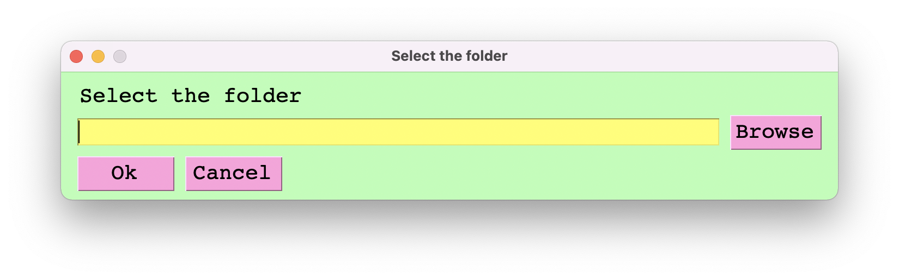
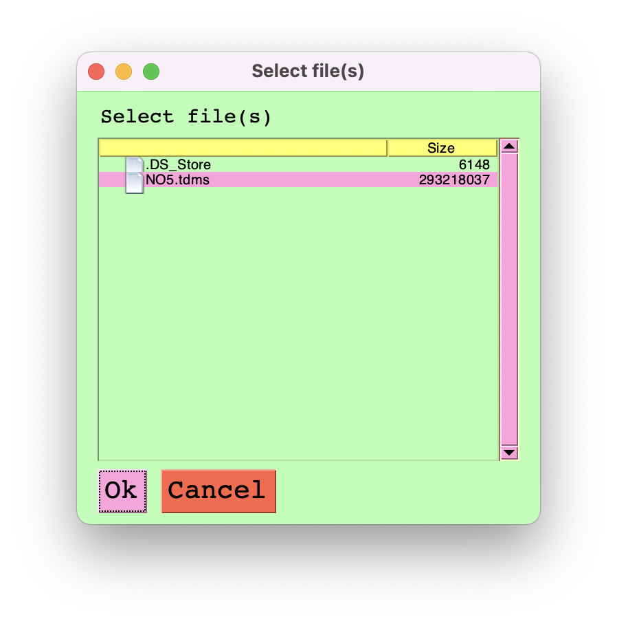
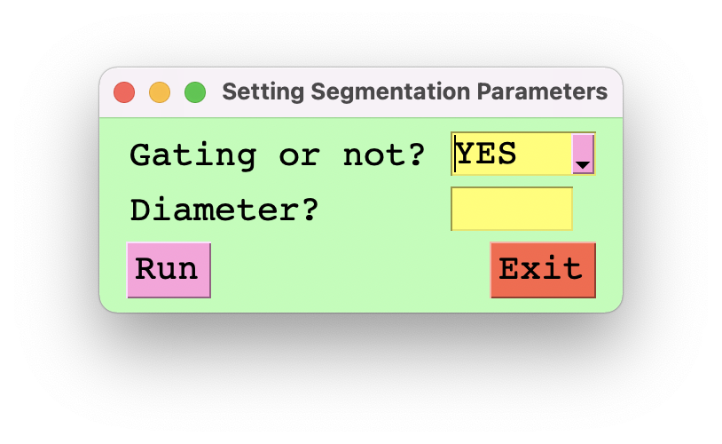
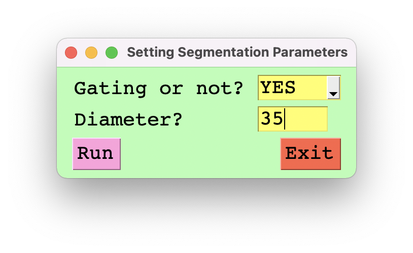

# Cell segmentation
## Table of contents
* [General info](#general-info)
* [Workflow](#workflow)
* [GUI](#gui)
* [Results](#results)

## General info
We aim at summing up the fluorescent intensity of SWCNTs incubated in each cell and counting the frequencies of different integrated-intensities, which will lay the foundation of further analysis.
For cellular segmentation, we use the API from [Pachitariu, M. & Stringer, C. (2022). Cellpose 2.0: how to train your own model. Nature methods, 1-8.](https://github.com/mouseland/cellpose)

## Workflow
The general worflow is described below:
### 1. Read the input brightfield and fluorescence microscope images
- Size of the image is 640x512.
- Each brightfield image (SPE file) contains 15 frames and each flurescence image contains 7 frames.
- At each pixel, the intensity accumulates frame by frame. As a result, we use the slope `a` of function `y=ax+b`, where `x` is `frame` and `y` is `accumulated intensity`, as the real intensity at a single pixel. See [segmentation_from_spe.ipynb](segmentation_from_spe.ipynb) for schematics.
### 2. Perform cell segmentation on the brightfield images
- We use the [Cytoplasm Model](https://cellpose.readthedocs.io/en/latest/models.html#cytoplasm-model-cyto) provided by [cellpose API](https://cellpose.readthedocs.io/en/latest/index.html) to perform cell segmentation on our brightfield images.
- Method [`eval`](https://cellpose.readthedocs.io/en/latest/api.html#cellpose.models.Cellpose.eval) is used to run the model and get mask-related parameters.
- Parameter `diameter` for method `eval` is critical. We can set it up in the GUI.
- We then use [cellpose.io.save_masks](https://cellpose.readthedocs.io/en/latest/api.html#cellpose.io.save_masks) method to convert mask-related parameters into cells' outlines.
### 3. Process outlines
- The outlines for each brightfield image are stored in one single text file, in which each line consists of the x and y coordinates of the outline for one single cell.
- We do some data processing to read in the outline text file and store all the x and y coordinates in a list `boundaries`.
### 4. Calculate fluorescence intensity in each segmented cell and count the frequencies
- The way of calculating fluorescence intensity is to simply sum up all the fluorescence intensity inside each outline (or say boundary).
- We stack the outlines we got from brightfield images onto fluorescence images and then integrate the intensity.
- We construct two types of intensity-summing methods: with and without gating:
  - With gating, we only count the cells that are not too small (e.g. not being cut off by the borders) and cells that are not aggregate together (e.g. cluster).
  - Without gating, we count every cell that is outlined from the brightfield images.
- Finally, we count the frequencies of different integrated-intensities.
## GUI
For better user experience and to make this program accessible for lab member who needs to do cell segmentaion and count the SWCNT fluorescence intensity inside each cell, I create an GUI that embeds the abovementioned workflow into a user-friendly interface. The complete GUI is shown as follows:
### 1. Call the program and select the folder in which the files are stored

### 2. Select the TDMS file 

### 3. Set up segmentation parameters

### 4. Run the program
- Press `Run` to run the program.
- You will get a folder with a name same as the input TDMS file, in which all files are stored.

## Results
- For each set of input brightfield and fluorescence image, we will get 5 images:
  - brightfield
  - fluorescence
  - brightfield with cell outlines
  - fluorescence with cell outlines
  - fluorescence with labeled cell outlines
- So if we take 80 sets of brightfield and fluorescence images, we will get 800x5 = 400 images.
- After summing up fluorescence intensity of each labeled cell in [fluorescences images with labeled outlines](./schematics/segf2_20.tiff), we count the frequencies of different intensities. This is done across all sets of fluorescence iamges. For example, if we take 80 fluorescence images, we count the frequencies over 80 images.

### 1. Brightfield image

### 2. Fluorescence image

### 3. Brightfield image with cell outlines

### 4. Fluorescence image with cell outlines

### 5. Fluorescence image with labeled cell outlines
