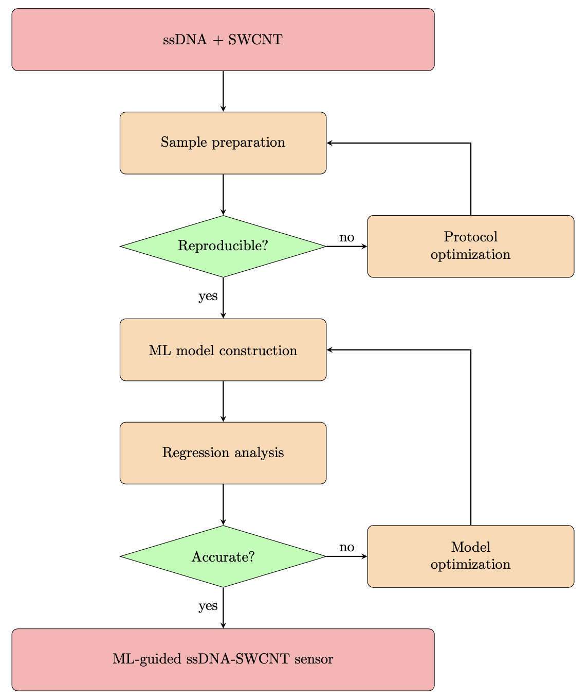

# Deep Learning-Guided Discovery of Carbon Nanotube-Based Near-Infrared Nanosensors for Cocaine

## Table of contents
* [Motivation](#motivation)
* [Methods](#methods)
* [Results](#results)

## Motivation
With desirable optical and fluorescent properties, single-walled carbon nanotubes (SWCNTs) have been successfully demostrated as biological sensors with high sensitivity. On the other hand, aptamers, which are nucleic acid based binding molecules, have great potential to serve as sensors in a wide variety of applications, such as medical diagnostics and drug detection.

Given that both aptamers and SWCNTs are prime candidates as sensors, incorporating aptamers into SWCNTs might be able to realize a sensor with high selectivity and real-time detection capability.

While the idea is of great promise, fluorescent sensors based on ssDNA-SWCNTs have barely been put into practice. The challenge that limits the development lies in the enormous search space of possible ssDNA sequences and the reproducibility of such sensors.

With this project, we aim to identify the appropriate ssDNA-SWCNTs combinations with desirable property efficiently.
The objectives of the current study are listed as follows:
```
1. To develop a protocol for producing reproducible ssDNA-SWCNTs nanosensors.
2. To construct a machine learning model that achieve acceptable predcition accuracy with as little training data as possible.
```

## Methods


## Results
STILL IN PROGRESS...
