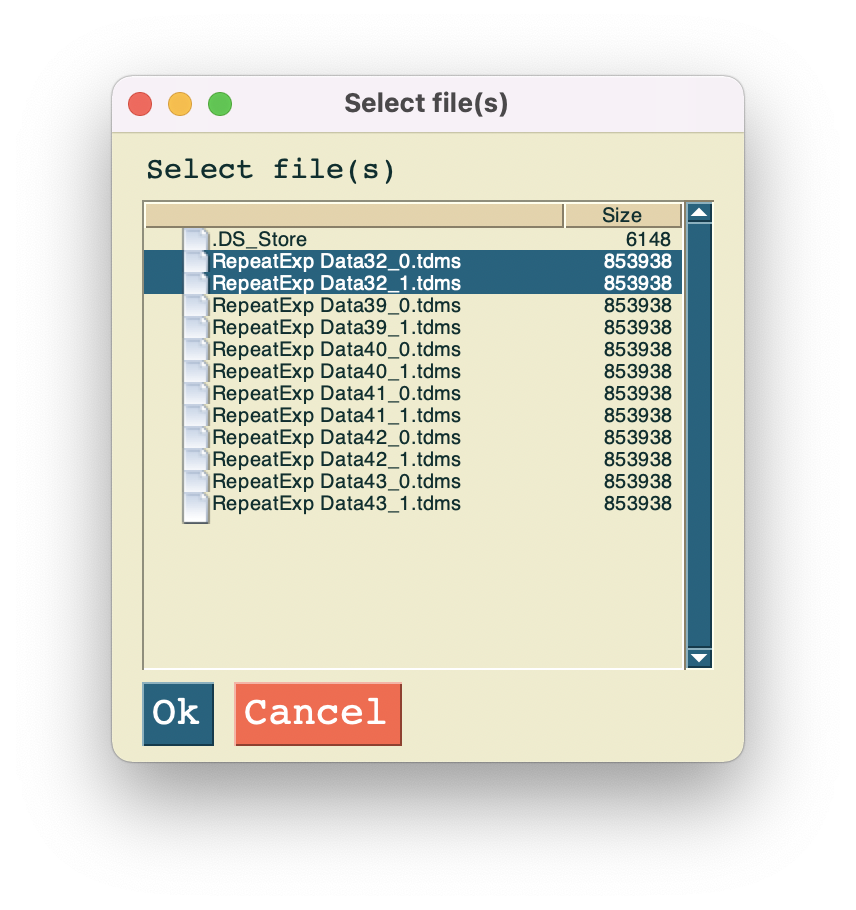
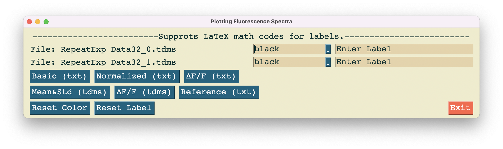
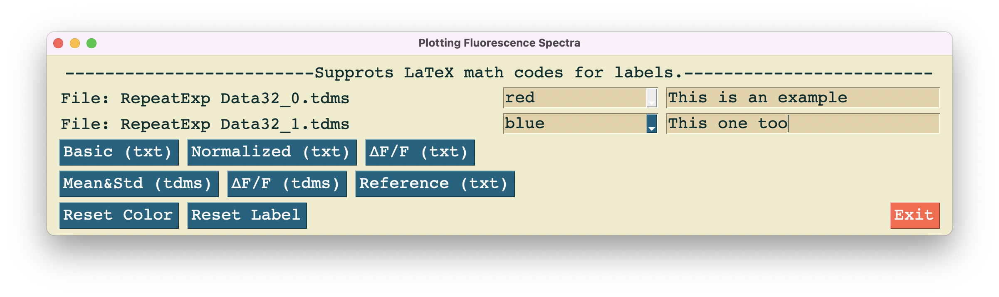

# Plot fluorescence spectra
## Table of contents
* [General info](#general-info)
* [Data processing](#data-processing)
* [Plotting spectra](#plotting-spectra)

## General info
  Visualizing fluorescent data is essential for analyzing our SWCNT-based sensors' performance. However, processing data and setting parameters for a figure are time-consuming and repetitive. As a result, I wanted to create a GUI that supports plotting fluorescence spectra with my own customized settings.
## Data processing
  - We focus on near-infrared (NIR) region, especially 930 nnm to 1370 nm, for our SWCNT-based sensors. So the first step is to interpolate the raw data and use the function to generate 640 new points between 930 nm and 1370 nm.
  - If the input data is in text file, we simply read it and plot it.
  - If the input data is in Tdms file, we first read 512 wavelengths between ~800 nm and 1700 nm. Secondly, we calculate the mean intensity and standard deviation at 512 different wavelengths.
## Plotting spectra
### 1. Call the program and select the folder in which the files are stored

### 2. Select the files containing fluorescence data

### 3. Set the colors and labels for the curves in spectra
- Default setting

- Pick colors and set labels at your will

### 4. Get your spectra

- You can save the spectra by pressing the `save` button in the bottom left corner
